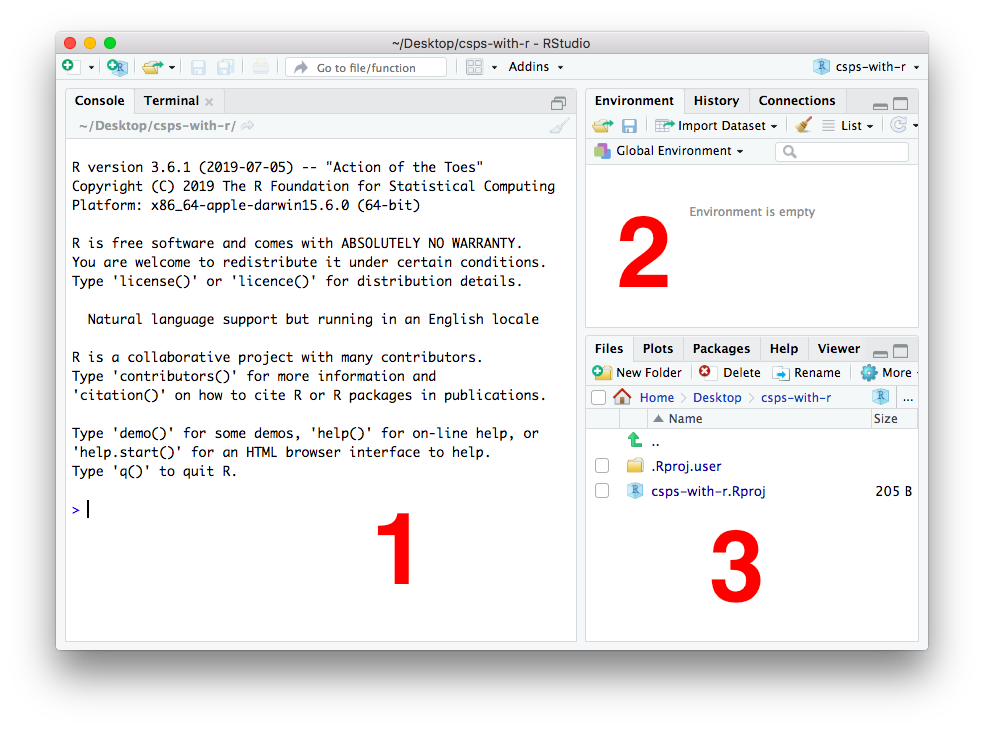

```{r setup, include=FALSE}
knitr::opts_chunk$set(echo = TRUE, comment = NA, width = 80)
library(countdown)  # remotes::install_github("gadenbuie/countdown")
```

---

# This session

## Summary

This session is a *very* brief introduction to R and RStudio for beginners, with reference to Civil Service People (CSPS) Data.

There's a lot of material about R and about the CSPS data that we aren't going to have time to cover today.

We'll be developing this guidance and making it freely available on the web. It will include more information on tidying, analysing, plotting and reporting.

**Important note on the data**: the data used in this document **is not real data**. Instead, it's a 'synthetic' version created using [the {synthpop} package](https://cran.r-project.org/web/packages/synthpop/vignettes/synthpop.pdf). This preserves data distributions without any response being that sampled from a real individual.

## Code along

This session is designed as a 'code-along'. You'll be asked to type what you see on screen as we go along.

Ideally you have R and RStudio installed already and you are able to download packages. In which case, you can do everything outlined in this document from your computer.

If you don't have R and RStudio and you can't download packages, then you can use a cloud-hosted version of RStudio which will open in your browser. Click this button below to launch it:

<!-- badges: start -->
[](https://mybinder.org/v2/gh/matt-dray/csps-with-r-demo/master?urlpath=rstudio)
<!-- badges: end -->

You may need to try more than once for it to load, or try a new browser if it repeatedly fails.

This is not how you would normally access RStudio; this has been set up so you are able to follow along with the demonstrations in the session. 

After a period of inactivity, your instance of RStudio will shut down. Note that anything code you write won't be preserved. You will need to copy, paste and save anything you write into a file on your computer instead.

Note that you won't be able to install any packages, but the packages of the tidyverse have been installed for you. You can access them with a call to `library(tidyverse)`. The data have also been supplied in the `data/` folder.

## Background

The annual CSPS produces a lot of data each year. Departments are provided with summary reports, but can access response-level data ('microdata') to perform their own in-depth analyses.

Many tools like Excel, SPSS and Stata are used across government to analyse the microdata. Many of these tools are proprietary and require expensive licenses. This variety can make it tricky for analysts to share approaches between departments and even within them. 

<br>
<div class="activity"> `r icon::fa("edit")` <b>Activity</b>

* What program do you use for analysis?
* Have you used R before?
* What makes you want to use R?

</div>
<br>

Of course, every analyst and every department is welcome to use the tools that are available to them, that they understand and that get the job done. 
Having said this, we're advocating for the [statistical programming language R](https://www.r-project.org/about.html) and the [RStudio](https://rstudio.com/) code editor.

# R and RStudio

## Why?

Why R? It:

* is free and open source
* has a strong community of users across government and the world
* handles all steps of an analysis from reading data to writing reports
* makes your work reproducible because the code can be re-run by you in future with the same or different data
* has highly configurable graphics, including interactives
* has tools for building apps and interactive 'dashboards' to let users explore your data

RStudio is a popular and well-supported piece of software for editing and running R code for both beginners and advanced users. It's also free of charge and the company behind it is [a public benefit corporation](https://blog.rstudio.com/2020/01/29/rstudio-pbc) with a commitment to producing open source software.

## {cspstools}

In particular, the CSPS team are developing some R-based tools for analysing CSPS data specifically. You will be able to download a package called {cspstools} that contains common functions for analysing CSPS data. This will help provide consistency in analysis and reporting and make tasks easier to perform and more reproducible. The tools will be shared in the open for anyone to use and so that anyone can help to improve them.

## Download

Before starting, you should download:

* [R](https://cran.ma.imperial.ac.uk/)
* [RStudio Desktop](https://rstudio.com/products/rstudio/download/) (open-source license)

Both are free, but you might need to get in touch with your IT team to get them insalled to your computer.

## RStudio layout

Open RStudio -- its icon is a white letter 'R' in a blue circle: 

When you open RStudio for the first time, you'll see the window is split into three 'panes', which are numbered below:



Your window may not look *exactly* like this one, depending on your operating system.

Labelled in the image are:

1. The console pane -- code is executed here
2. The environment pane -- stored values, tables, plots, etc, are displayed here
3. The files pane -- navigate your folder structure (also has tabs for showing plots and help)

We don't need to concern ourselves with every button and tab for now. 

## Project folders

There are many benefits to having one folder per analytical project. It means your work is more:

* organised -- all the code, data, outputs, etc, are stored in one place (a single project folder)
* reproducible -- your code can be re-run from scratch to produce the same outputs every time
* transferable -- you can pass the entire project folder to someone else and they'll be able to run it on their own machine; the filepaths you specify in your code assume the home folder is the project folder, so you can write something like `data/dataset.csv` rather than `file/path/on/my/personal/machine/that/you/cannot/access.csv`

RStudio has a system that helps you set this up. You can create an 'RStudio Project' like this:

1. Open RStudio (the icon is a white R inside a blue circle)
2. File > New Project...
3. New Directory > New Project
4. Give your project a meaningful name in the 'Directory Name' box (e.g. `csps-r` for this session)
5. Browse for the filepath where your R Project folder will be placed
6. Click 'Create Project' and RStudio will open your project (note the project name in the top right)


This creates a folder where you specified that contains an RStudio Project file (extension '.Rproj'). This folder is the 'home' of your project and this is where you should house all the files and code that you need.

For now, create two new folders -- `data` and `output` -- in your Project folder (we'll be using these later).

We haven't created any R script files yet, but they'll go in the project folder too.

This means we'll get a folder structure like this:

```
csps-r/              # the project folder
  ├── csps-r.Rproj   # R Project file
  ├── data/          # read-only raw data
  ├── output/        # processed data
  └── training.R     # R script files
```

To access your RStudio Project in future, navigate to the project folder and double-click your R Project file, which has the .Rproj extension (e.g. `your-project.Rproj`). It will open RStudio in the same state that you left it when you last closed it.

## Start a new script

You'll write your code into a special text file called an R script, which has the extension `.R`.

Having opened the R Project (.Rproj) file for your analysis, open a new script by clicking File > New File > R script. A new blank script will appear in a new pane in the upper left of the RStudio window.

You can type or copy and paste code into this document. This serves as a record of the actions you used to analyse the data step-by-step.


<br>
<div class="tip"> `r icon::fa("lightbulb")` <b>Tip</b>

* You can have multiple scripts open at once
* They will appear as separate tabs in the scripts pane

</div>
<br>

# R fundamentals

## Comments

In an R script, any characters prefixed with a hash (`#`) will be recognised as a comment. R will ignore these when you run your code.

Comments are really helpful for letting people to understand what your code is doing. Try to keep a narrative going throughout your code to explain what it's doing. Be explicit -- it might be obvious to you right now why a certain line code is being written, but you might come back in a few months time and forget.

It's also good to use comments to explain what each block of code is doing and to explain particular lines of code. Don't worry about the code itself, but here's an example of comments in use:

```{r comments, eval=FALSE}
# Subset the data
data_set %>%
  filter(column_a > 10) %>%  # 10 is the cut-off point
  mutate(column_c = column_a + column_b)
```

It's also good to add the title, your name, date, etc, as comments at the top of your script so people know what the script is for when they open it.

## Run code

How do you actually run some R code? Let's start with a small calculation.

First, we'll add two numbers together. Type the calculation `1 + 1` into your script:

```{r add-notrun, eval=FALSE}
# Add two numbers together
1 + 1
```

To execute it, make sure your cursor is on the same line as the code and press <kbd>Command</kbd>+<kbd>Enter</kbd> on a Mac or <kbd>Control</kbd>+<kbd>Enter</kbd> on a PC (there's also a 'Run' button in the upper right of the script pane). You can also run multiple bits of code by highlighting selected lines and then running it.

What happened when you ran the code? The following was printed to the console in the lower-left pane of RStudio:

```{r add-run, echo=FALSE}
# Add two numbers together
1 + 1
```

Great, we got the answer `2`, as expected. (The number in square brackets is related to the the number of items retuned in the answer and doesn't concern us right now.)

<br>
<div class="tip"> `r icon::fa("lightbulb")` <b>Tip</b>

* Don't forget to save your script file
* Go to `File` > `Save` or use the <kbd>Control</kbd>+<kbd>S</kbd> or <kbd>Command</kbd>+<kbd>S</kbd> shortcuts

</div>
<br>

## Store a result

This is good, but ideally we want to store objects (values, tables, plots, etc), so we can refer to them in other pieces of code later.

You do this in R with a special operator: the 'assignment arrow', which is written as `<-`. The shortcut for it is <kbd>Alt</kbd>+<kbd>-</kbd> (hyphen).

For example, we can assign `1 + 1` to the name `my_num` with `<-`. Execute the following code:

```{r define-object}
my_num <- 1 + 1
```

Hm. Nothing printed out in the console. Instead the object is now stored in your 'environment' -- see the top right pane in RStudio:


You can now refer to this object by name in your script. For example, you can print it:

```{r print-object}
print(my_num)
```

<br>
<div class="tip"> `r icon::fa("lightbulb")` <b>Tip</b>

* You can actually print an object by running it's name alone:
* Running `my_num` is equivalent to `print(my_num)`
* I'll be using `print()` throughout to be more explicit

</div>
<br>

The real benefit to this is that you don't have to repeat yourself every time you want to use that particular calculation. For example, you can refer to the object in new expressions:

```{r use-object}
my_num * my_num + 6
```

<br>
<div class="tip"> `r icon::fa("lightbulb")` <b>Tip</b>

* Use names that are meaningful, relatively short and use consistent naming conventions (like 'snake_case', which is all lowercase and separates words with underscores)
* For example, `var_mean` and `var_median`
* Names are case sensitive, can't have spaces, nor start with a number

</div>
<br>

<div class="activity"> `r icon::fa("edit")` <b>Activity</b>

* Make an object called `val1` that stores the value 543
* Make another object called `val2` that stores the value 612
* Make a third object called `calc` that is the multiplication (`*`) of `val1` and `val2` 
* What value do you get when you print `calc`?

`r countdown(minutes = 1, seconds = 0, style = "position: relative; width: min-content;")`

</div>
<br>

## Object classes

We stored a numeric value in the last section. We can do more than just store one item of data at a time though.

This next chunk of code _combines_ multiple elements with the `c()` command. This kind of multi-element object is called a 'vector'.

Here's a vector that contains text rather than numbers. You put character strings inside quotation marks (`""`), which isn't needed for numbers.

```{r vectors}
# Create an example vector
dept_names <- c("DfE", "DHSC", "DfT")  # combine some values
print(dept_names)  # have a look at what the object contains
```

So each of the elements of the object was returned.

You can see what 'class' your object is at any time with the `class()` function. 

```{r class-vector}
class(my_num)
class(dept_names)
```

<br>
<div class="tip"> `r icon::fa("lightbulb")` <b>Tip</b>

* To create a vector of numbers, you could write `c(1, 2, 3)`
* There's a shortcut for this: `1:3`
* This means 'all the numbers from 1 to 3 including 1 and 3'

</div>
<br>

So we've create objects composed of a single values (`my_num`) and a vector of values (`dept_names`).

The next step would be to combine a number of vectors together to create a table with rows and columns. Tables of data with rows and columns are called 'data frames' in R and are effectively a bunch of vectors of the same length stuck together.

Here's an example of a data frame built from scratch:

```{r create-df}
# Create a data frame of selected departments
dept_info <- data.frame(
  dept = dept_names,  # use vector from earlier
  headcount = c(6900, 8300, 15000),
  responsibility = c("Education", "Health", "Transport")
)

print(dept_info)  # see the data frame
```

Can you see how the data frame is three vectors (`dept`, `headcount` and `responsibility`) of the same length (3 values) arranged into columns? The function `data.frame()` bound these together into a table format. Let's check the class:

```{r class-df}
class(dept_info)
```

R is capable of building very complex objects, but tabular data with rows and columns is ubiquitous and it's how the CSPS data is stored. We'll be focusing on data frames for now. 

## Use a function

You've been using functions already: `print()`, `c()`, `data.frame()`, `class()`.

A function is a reproducible unit of code that performs a given task, such as reading a data file or fitting a model. There are any of these built into R already, but you can also download 'packages' of functions and you can also create your own.

Functions are written as the function name followed by brackets. The brackets contain the 'arguments', which are like the settings for the function. One argument might be be a filepath to some data, another might describe the colour of points to be plotted. They're separated by commas.

So a generic function might look like this:

```{r generic-function, eval=FALSE}
# This isn't a real function; don't run it
function_name(
  data = my_data,
  colour = "red", 
  option = 5
)  
```

Note that you can break the function over several lines to improve readability and so you can comment on individual arguments. You can put your cursor on any of these lines and run it. You don't have to highlight the whole thing.

You can use type a question mark followed by a function name to learn about its arguments. This will appear in a help file in the bottom right pane. For example, `?plot()`.

<br>
<div class="tip"> `r icon::fa("lightbulb")` <b>Tip</b>

* You can create your own functions, but we're not going to spend time on that now
* This is a good way to stop repeating code
* Here's an example that adds two provided numbers together:

```{r example-function}
# Define a function that adds two numbers
add_nums <- function(val_a, val_b) {
  val_a + val_b
} 

add_nums(val_a = 3, val_b = 4)  # use the function
```
</div>
<br>

## Install and load packages

Functions can be bundled into packages. A bunch of packages are pre-installed with R, but there are thousands more available for download. These packages extend the basic capabilities of R or improve them.

Packages can be installed to your computer using the `install.packages()` function. This automatically fetches and downloads packages from a centralised package database on the internet called [CRAN](https://cran.r-project.org), which only accepts packages that meet strict quality criteria.

<br>
<div class="tip"> `r icon::fa("lightbulb")` <b>Tip</b>

* Packages _can_ be downloaded from places other than CRAN
* You can download packages from open online repositories like GitHub
* You may need your IT team to authorise or install packages for you

</div>
<br>

We're going to use a few packages to help us:

* [{haven}](https://haven.tidyverse.org/) for reading a range of file types, like Stata's (.dta) and SPSS's (.sav)
* [{dplyr}](https://dplyr.tidyverse.org/) for data cleaning and preparation
* [{ggplot2}](https://ggplot2.tidyverse.org/) for plotting

<br>
<div class="tip"> `r icon::fa("lightbulb")` <b>Tip</b>

* {haven}, {dplyr} and {ggplot2} are part of a larger suite of packages called ['the tidyverse'](https://www.tidyverse.org/)
* This is a set of packages that share a common design philosophy and seek to make analysis more intuituve
* The RStudio company produces the majority of the packages in the tidyverse
* You can download all the packages of the tidyverse at once with `install.packages("tidyverse")`

</div>
<br>

Typically you would type `install.packages("packagename")` to download the package, but we can use the following to install the packages from the tidyverse all at once:

```{r install-packages, eval=FALSE}
install.packages("tidyverse")
```

You only need to run the installation function once per package on your machine.

Each time you start a new session you'll need to run `library("package_name")` to tell R to make available the functions from a that package so you can use them in your script.

So now we have the `tidyverse` packages installed we can call the packages we need with `library()`.

```{r libraries}
library("haven")    # data reading
library("ggplot2")  # plotting
library("dplyr")    # data wrangling
```

Sometimes a message will be printed to tell you a bit more about the package, which is what happens for {dplyr}.

We can start using functions from these packages now that they're loaded.

It's good practice to write the `library()` lines near the top of your script file so that others know which packages are being used in the script.

# Data

## Synthetic data

We aren't using real CSPS data for these exercises. Instead, we'll be using a 'synthetic' version that mimics the 2019 data.

In short, this means that the data distributions within the variables are preserved, but no response represents a real individual. This means we can get some realistic-looking outputs without any response being from a real individual.

We've also restricted the number of variables (columns) and rows (responses) to keep the data set relatively small, and have added a fake unique ID value.

The variables are in the synthetic data set are:

* ResponseID (a faked unique respondent identifier) and OverallDeptCode (the department name)
* B01 to B05 (questions about 'my work') and B47 to B51 (engagement questions)
* E03 and E03_GRP (have you been bullied or harassed n the past 12 months?) and E03A_1 to E03A_16 (a column for each possible response to the bullying, harassment or discrimination experienced)
* W01 to W04 (wellbeing questions)
* J03 (ethnicity)
* Z02 (civil service grades)
* ees (a derived variable that translates each engagement question score to a percentage and takes the mean)
* mw_p (a derived variable that gives the proportion of responses to the 'my work' theme questions that were positive, i.e. 'agree' or 'strongly agree')

## Get the data set

Ordinarily we would send you the data for your organisation on request. For this session, we've prepared the synthetic data set as a Stata-format (.dta) file.

You can download it to your machine with the `download.file()` function. Save it to the `data/` folder of your project using the `destfile` argument.

```{r download-file, eval=FALSE}
download.file(
  url = "https://github.com/co-analysis/csps-synth/blob/master/output/csps_synth.dta",
  destfile = "data/csps_synth.dta"  # where to save it
)
```

Alternatively, you can visit the link and click the 'download' button,then save it to the `data/` folder of your project.

Now take a look at the 'Files' pane in RStudio. Navigate into the `data/` folder. The .dta file should now be in there.

# Read

There's a number of functions for reading in data to R. A common one is `read_csv()` from the tidyverse's {readr} package.

The {haven} package has a function called `read_stata()` that you can use to read in a .dta file. Let's read in the data with this function and name the object 'data'.

```{r haven-read}
data <- read_stata(file = "data/csps_synth.dta")
```

This will read the data in as a 'tibble', a fancier type of data frame that's used by the tidyverse packages. For example, when printed to the console, tibbles use colour coding and are truncated to fit.  

<br>
<div class="activity"> `r icon::fa("edit")` <b>Activity</b>

How do you know that the data has been successfully read into R?

</div>
<br>

## Inspect

It's good to preview the data and check it looks like what we expected.

### Glimpse the structure

The {dplyr} package that we loaded earlier has a function called `glimpse()`, which tells you about the structure of the data.

```{r glimpse}
glimpse(data)
```

The top of the output tells us there's 11,555 observations (rows) and 38 variables (columns).

Column names are then listed with the data type and the first few examples. For example, 'OverallDeptCode' contains character class (`<chr>`) data in the form of strings. Column names starting with 'B', 'E', 'J' and 'Z' are question codes and they contain responses expressed in numeric form, so they're of class 'double' (`<dbl>`).

The numbers encode certain responses. For example, 1 means 'strongly disagree' and 5 means be 'strongly agree' for the 'B' series of questions.

How do we know what all the numeric values mean? You'll see that a number of the columns have the label class (`<lbl>`) too. This means that the column carries additional 'attributes' that give the corresponding labels for the values.

Labels aren't used that freuqently in R data frames, but are used in programs like Stata and SPSS. Since we've read in a Stata file, we've got these labels available to us.

You can also see that there are also lots of `NA` values. R uses `NA` to mean 'not available' -- the data are missing. In this case, it means that the respondent didn't supply an answer for that question.

### See the full data

Another way of expressing this is to `print()` to the console.

```{r print}
print(data)
```

The output is displayed in table format, but is truncated to fit the console window (this prevents you from printing millions of rows to the console!). You can see the labels are printed alongside the values in this view.

If you want to see the whole datset you could use the `View()` function:

```{r View, eval=FALSE}
View(data) # note the capital 'V'
```

This opens up a read-only tab in the script pane that displays your data in full. You can scroll around and order the columns by clicking the headers. This doesn't affect the underlying data at all.

You can also access this by clicking the little image of a table to the right of the object in the environment pane (upper-right). 

# Wrangle

We're going to use a number of functions from the {dplyr} package, which we loaded earlier, to practice some data manipulation.

Functions in the tidyverse suite of packages are usually verbs that describe what they're doing, like `select()` and `filter()`.

We won't have time to go thorugh all of the functions and their variants, but you should get a flavour of what's possible.

## Select columns

Firstly, we can `select()` columns of interest. This means we can return a version of the data set composed of a smaller number of columns. This can be helpful for a number of reasons, but inparitcular it lets us focus on specfic variables of interest.

The {dplyr} functions take the data frame as their first argument, so the first thing we'll supply the function is our `data` object. Then we can supply the names of columns that we want to keep. Note that we can also rename columns as we select them with the format `new_name = old_name`. (Alternatively there is a `rename()` function that only renames columns.)


```{r select}
# Return specific columns
select( 
  data,                 # the first argument is the data
  Z02, ethnicity = J03  # then the columns to keep
)
```

See that the order in which we selected the columns is the order in which they appeared when printed.

Instead of naming columns to keep, you can also specify columns to remove by prefixing the column name with a `-` (minus).

<br>
<div class="tip"> `r icon::fa("lightbulb")` <b>Tip</b>

* It's worth noting that our original data set (`data`) remains unchanged, despite us having selected some columns
* Usually you will wrangle a data set and save it with a different object name so the original is always available to you
* You can overwrite an original variable by using its name again, but it's usually best to avoid this
* For example, `data <- select(data, B01)` would overwrite our original `data` object

</div>
<br>

To save time you can use some special `select()` helper functions. For example, you can select a column that `contains()` or `starts_with()` certain strings. This is useful if you have lots of columns that share a simmilarity in their names, like in the CSPS (e.g. B01, B02, etc, all start with "B").

```{r select-3}
# Use select helpers to make code concise
select(data, contains("ID"), starts_with("W"))
```

<br>
<div class="activity"> `r icon::fa("edit")` <b>Activity</b>

1. Use `select()` to return all the 'B' series columns (B01, B02, etc)
1. How many columns are in this selection?
1. Do the same, but *without* the B02 column

`r countdown(minutes = 2, seconds = 0, style = "position: relative; width: min-content;")`

</div>
<br>

## Filter rows

Now to filter the rows of the data set based on certain criteria.

We're going to make use of some [logical operators](https://stat.ethz.ch/R-manual/R-devel/library/base/html/Logic.html) for filtering our data. These return `TRUE` or `FALSE` depending on the statement's validity.

| Symbol | Meaning | Example |
| :-- | :-- | :-- |
| `==` |  Equal to |  `5 == 2 + 3` returns `TRUE` |
| `!=` |  Not equal to |  `5 != 3 + 3` returns `TRUE` |
| `%in%` | Match to a vector (shortcut for multiple logical tests) | `4 %in% c(2, 4, 6)` returns `TRUE` |
| `>`, `<` | Greater than, less than | `2 < 3` returns `TRUE` |
| `>=`, `<=` | Equal or greater than, equal or less than | `5 <= 5` returns `TRUE` |
| `&` | And (helps string together multiple filters) | `1 < 2 & 5 == 5` returns `TRUE` |
| `|` | Or (helps string together multiple filters)  | `1 < 2 | 5 == 6` returns `FALSE` (only one of them is true) |

R also has some special shortcut functions for come logical checks. For example:

| Symbol | Meaning | Example |
| :-- | :-- | :-- |
| `is.numeric()` |  Is the content numeric class? | `is.numeric(10)` returns `TRUE` |
| `is.character()` | Is the content character class? | `is.character("Downing Street")` returns `TRUE` |
| `is.na()` | Is the content an `NA`? | `is.na(NA)` returns `TRUE` |

You can negate these funtions by preceding them with a `!`, so `is.na(NA)` returns `TRUE` but `!is.na(NA)` returns `FALSE`.

Let's start by creating an object that contains the data filtered for senior civil servants (where variable Z02 equals 5) from two of the organisations.

```{r filter}
scs_orgs <- filter(
  data,
  Z02 == 5 & OverallDeptCode %in% c("ORGB", "ORGC")
)
```

See how there are two filter statements: `Z02 == 5` and `Organisation %in% c("ORGB", "ORGC")`? We're asking for both of these things to be true by using the `&` operator between them.

Notice that we used `%in%` to match to a vector of department names (this is quicker than writing `OverallDeptCode == ORGB | OverallDeptCode == ORGC`). The names are stored as character strings, so we put them in quotation marks.

We could print the columns of interest to see if it worked, but a better method would be to return only the 'distinct' (unique) values in these columns:

```{r filter-distinct}
distinct(scs_orgs, OverallDeptCode, Z02)
```

<br>
<div class="activity"> `r icon::fa("edit")` <b>Activity</b>

1. Use `filter()` to return senior civil servants in Org A only
2. Use `distinct()` to make sure it's worked
2. How many rows are in this filtered data set?

`r countdown(minutes = 2, seconds = 0, style = "position: relative; width: min-content;")`

</div>
<br>

## Add new columns

Now to create new columns. The function name is `mutate()`; we're 'mutating' our dataframe by budding a new column where there wasn't one before. Often you'll be creating new columns based on the content of columns that already exist, like adding the contents of one to another.

One relevant use of this for the CSPS is to create dummy columns. If certain conditions are met in other columns, we can put a '1' in the dummy column, else we can put '0' if it's not met.

So we could create a dummy column that flags when a respondent is a SEO/HEO grade. This example uses an `ifelse()` statement that fills the column with one value if the logical test is `TRUE` and another if it's `FALSE`.

```{r mutate}
# Add a column that gets a 1 when the condition is true
data_dummy <- mutate(
  data,
  dummy = ifelse(  # create a new column called 'dummy'
    test = Z02 == 3 & J03 %in% 1:4, # test this condition
    yes = 1,       # if TRUE, put a 1 in the dummy column
    no = 0         # otherwise put a 0 in the column
  )
)

# See if it worked
select(data_dummy, Z02, J03, dummy)
```


<br>
<div class="activity"> `r icon::fa("edit")` <b>Activity</b>

Use `mutate()` to create a dummy column where:

* people who responded with 'strongly agree' (`5`) to both B01 *and* B02 get a `1`
* everyone else gets a `0`

`r countdown(minutes = 2, seconds = 0, style = "position: relative; width: min-content;")`

</div>
<br>

This function is particularly useful for the CSPS data if we want to overwrite our numeric values with their corresponding text labels. Fortunately, the {haven} package that we loaded earlier has a function that replaces the numeric values with their labels: `as_factor()`.

We want to apply this only to the columns that are numeric. Fortunately there's a variant of `mutate()` called `mutate_if()`, which lets you use logical statements to select columns. This means we don't have to write out all their names.

```{r as-factor, eval=FALSE}
# Add a column that gets a 1 when the condition is true
data_lbl <- mutate_if(
  data,
  is.numeric,  # if the column is numeric
  haven::as_factor  # then apply the as_factor function
)

data_lbl_chr <- mutate_all(data_lbl, as.character)

glimpse(data_lbl_chr)
```

<br>
<div class="tip"> `r icon::fa("lightbulb")` <b>Tip</b>

* There's more than one function called `as_factor()` -- how can we resolve this?
* We can specify that we mean the one from the {haven} package by writing it in the form `package::function()`

</div>
<br>

## Join

We can use variant `join()` functions to merge two data frames together on a common column.

Let's create a small trivial data frame that provides a lookup from department codes to full department names and merge it into our CSPS data.

We'll use the `tibble()` function from {dplyr} to build the data frame. Remember: tibbles are data frames with nice defaults and printing properties; we've seen them already in the outputs from our earlier wrangling with {dplyr}

```{r dept-lookup}
lookup <- tibble(
  OverallDeptCode = c("ORGA", "ORGB", "ORGC"),
  dept_full_name = c("Dept for A", "Ministry of B", "C Agency")
)

print(lookup)
```

We want what is perhaps the most common join: `left_join()`. It gives you all the rows from the 'left' data set (in our case, `data`) and merges on the columns from the 'right' (our new `lookup`).

Here's what we'll be doing (gif by [Garrick Aden-Buie](https://www.garrickadenbuie.com/project/tidyexplain/)):


To do this, we pass two data frames to arguments `x` ('left') and `y` ('right') and provide the column name to join by.

```{r left-join}
data_join <- left_join(
  x = data,    # the original data set
  y = lookup,  # the data to merge to it 
  by = "OverallDeptCode"  # the common column between them 
)
```

You might get a message saying that the attributes for our joining column aren't the same. That's okay; it's because the column in `data` (the data set on the 'LHS', or 'left-hand side', of the join) has attributes, but the one in `lookup` (on the right-hand side) doesn't.

Let's check to see if rows from both data frames are present in the joined data set:

```{r inspect-join}
select(data_join, ResponseID, B01, OverallDeptCode, dept_full_name)
```

Success: the output has all the rows of the `data` data frame, plus the new one (`dept_full_name`) from the `lookup` data frame.

## Pipes

We've seen how to manipulate our data frame a bit. But we've been doing it one discrete step at a time, so your script might end up looking something like this:

```{r workflow-no-pipe}
data_select <- select(data, ResponseID, OverallDeptCode, B01, Z02)

data_filter <- filter(data_select, OverallDeptCode == "ORGA" & Z02 != 5)

data_mutate <- mutate(
  data_filter,
  positive = ifelse(B01 %in% c(4, 5), "Positive", "Not positive")
)

print(data_mutate)
```

This is fine, but you will be creating a lot of intermediate objects to get to the final data frame that you want. This clutters up your environment and can fill up your computer's memory if the data are large enough. You're in danger of accidentally referring to the wrong object if you don't name them well.

Instead, you could create one object that is built by chaining all the functions together in order.

We'll use a special pipe operator -- `%>%` -- that will read as 'take what's on the left of the operator and pass it through to the next function'. In pseudocode:

```{r eval=FALSE}
dataset %>%
  do something %>%
  do something %>%
  do something
```

A real example with our data might look like this:

```{r pipe}
data_piped <- data %>% 
  select(ResponseID, OverallDeptCode, B01, Z02) %>% 
  filter(OverallDeptCode == "ORGA" & Z02 != 5) %>% 
  mutate(positive = ifelse(B01 %in% c(4, 5), "Positive", "Not positive"))

print(data_piped)
```

So the steps for creating the `data_piped` object are: 

* take the `data` object
* *then* select out some columns
* *then* filter on a variable
* *then* add a column

This is a bit like a recipe. And it's easier to read.

You also repeat yourself fewer times. We only to name the `data` object once, a the very start. This minimises the chance that you'll accidentally name the wrong object by mistake.

## Save your wrangled data

There are a number of ways and formats in which to save our wrangled data.

For example, to save the output as a CSV, we can do one of these:

```{r write-files, eval=FALSE}
write_dta(data_piped, "output/data_piped.dta")  # Stata-format

# Other options
write_rds(data_piped, "output/data_piped.rds")  # R-specific format
write_csv(data_piped, "output/data_piped.csv")  # comma-separated values
```

You pass to the function the object name and the filepath for where you want it to be saved.

Note that the labels will be lost if you save as CSV, but they're retained in .dta and .rds format.

Check in your `output/` folder to make sure they've been saved.

You can then read these back in like how we did earlier in this document (you don't have to do this now):

```{r read-files, eval=FALSE}
data_rds <- read_rds("output/data_piped.rds")  # R-specific format
data_dta <- read_stata("output/data_piped.dta")  # Stata-format
data_csv <- read_csv("output/data_piped.csv")  # comma-separated values
```

# Summarise

So far we've been wrangling but not analysing data. Let's look at the `summarise()` function for some quick summaries.

A simple example might be to get the total count of responses in the data set and the mean of the engagement scores.

```{r summarise}
data %>%
  summarise(
    total_count = n(),
    ees_mean = round(mean(ees, na.rm = TRUE), 2)
  )
```

That's good, but we can extend the summary so we get results grouped by some other variables. 
This is what the `group_by()` function does. You give `group_by()` the variables within which to summarise and you finish by calling `ungroup()` so that the subsequent functions don't get applied to the groups.

So here's a more comprehensive example that gets the mean count and mean EES grouped within departments and the Z02 variable (grade). It then filters out people who didn't answer Z02 and uses a `mutate()` to suppress any mean EES values composed of less than 10 responses.

```{r group-by}
data %>%
  group_by(OverallDeptCode, Z02) %>% 
  summarise(
    total_count = n(),
    ees_mean = round(mean(ees, na.rm = TRUE), 2)
  ) %>% 
  ungroup() %>% 
  filter(!is.na(Z02)) %>% 
  mutate(
    ees_mean_supp = ifelse(
      test = total_count < 10, yes = NA, no = ees_mean
    )
  )
```

# Plot

We could have a whole separate session on visualising data.

The tidyverse package for plotting is called {ggplot2}. The 'gg' stands for 'grammar of graphics'. It's a system to build up a graphic using common components including:

* data
* 'geoms' (marks that represent the data)
* a coordinate system

You also supply aesthetic properties like size, colour, x and y locations.

<center></center><br>

These elements are built up with the `+` operator. Imagine you've created a blank canvas and you're adding each layer. (This is different to using the pipe, `%>%`, which is passing information from the left-hand side to the right-hand side.)

The great thing about building plots with code is that you can produce them with the same styles very quickly without all the manual adjustments that might be required in some other programs.

{ggplot2} is a very powerful graphics package that can create all sorts of charts. Check out [the R Graph Gallery](https://www.r-graph-gallery.com/) for some more examples.

## Simple plots

For now, let's look at a simple bar chart of the answers to question B01 using the `ggplot()` function from {ggplot2}.

```{r plot-simple}
# Prepare the data
plot_data <- data %>%
  filter(!is.na(B01)) %>%  # remove NAs
  count(OverallDeptCode, B01) %>%  # count() is a shortcut for summarising
  mutate(
    B01 = haven::as_factor(B01),  # add the text labels
    Department = OverallDeptCode
  )  

# Plot the data
plot_data %>%  # with the plot data
  ggplot(aes(x = B01, y = n)) +  # create a canvas with these coords
  geom_col()  # apply columns to the canvas given the coords
```

What just happened? We:

* gave ggplot() the dataset, `plot_data`
* gave it some aesthetic mappings, `aes()` (in this case, the x and y variables)
* added the column geom, `geom_col()`, to make a bar chart

We can spruce this up a little by adding on additional things like a theme or labels.

```{r plot-stacked}
ggplot(plot_data, aes(x = B01, y = n))  +
  geom_col(aes(fill = Department)) +
  coord_flip() +  # flip the axes
  theme_light() +   # apply a theme
  scale_fill_brewer(palette = "Blues") +  # set the bar colours
  labs(  # provide overall labels
    title = "Most people say they're interested in their work",
    subtitle = "This is true across all organisations",
    caption = "Source: B01, synthetic CSPS data"
  ) +
  xlab(NULL) +  # remove x axis
  ylab("Count of responses")  # y axis title
```

But we could also split each department's results into a grid of small multiples, or 'facets', with `facet_grid()`.

```{r plot-facet}
ggplot(plot_data, aes(x = B01, y = n))  +
  geom_col() +
  coord_flip() +
  theme_light() + 
  labs(
    title = "Most people say they're interested in their work",
    subtitle = "This is true across all organisations",
    caption = "Source: B01, synthetic CSPS data"
  ) +
  xlab(NULL) +
  ylab("Count of responses") +
  facet_grid(
    cols = vars(OverallDeptCode),  # one column per department
    scales = "free"  # scales are relative to the facet
  ) 
```

## Advanced plot
We can also use {ggplot} to recreate the style of bar charts used in the PDF reports of People Survey results. First we need to process the data to get the data for ORGB, reshape it into a plottable format, and calculate percentages. This section uses a couple of tidyverse packages we haven't seen yet: {tidyr} for reshaping data frames and {forcats} for working with vectors. These are shown as `package::function()` to make them more apparent.

``` {r plot-data2}
plot_data2 <- data %>%
  filter(OverallDeptCode == "ORGB") %>%
  select(B47:B51) %>%
  mutate_all(haven::as_factor) %>%      # convert the variables to factors
  tidyr::pivot_longer(                  # turn the data into 'long' format
    cols = everything(),                #    using all the columns
    names_to = "question",              #    assign names to variable 'question'
    values_to = "value"                 #    assign values to variable 'value' 
    ) %>%
  tidyr::drop_na(value) %>%             # drops any missing responses
  count(                                # count the combinations of:
    question,                           #   question, and
    value,                              #   value, and
    name = "response_count") %>%        #   give the count a specific name
  add_count(
    question,                           # add an extra count by question
    wt = response_count,                #   summing the 'wt' variable
    name = "question_count") %>%        #   give it a specific name
  mutate(
    pc = response_count/question_count, # calculate responses as % of question
    value = forcats::fct_rev(value),    # character strings are often better as
    question = forcats::fct_rev(        #   factors when plotting, but sometimes
      forcats::as_factor(question)      #   you need to reverse their 'order'
      )
  )

print(plot_data2)

```

We now have a dataset that has counted the responses for each question-value pair (`response_count`), the number of responses for each question (`question_count`) and a percentage response (`pc`), for questions B47-B52 for respondents in ORGB.

We can now plot this data, rather than Department we'll be plotting the questions on the "x-axis" and our calculated percentage on the "y-axis" (we'll actually flip these axes, but that's one of the last things we do, so it's best to still think of these in their original x-y positions).

We can also add data labels, using `geom_text()`.

The PDF survey reports use a colourblind friendly pink-green scale from the [{RColorBrewer}](https://cran.r-project.org/package=RColorBrewer) package, which provides the palettes developed by the [Color Brewer](http://colorbrewer2.org/) project.

Finally, we apply some customisation to the theme to remove the axis titles, reposition the legend, give the legend keys an outline, and format the title text.

``` {r plot-stacked2}

ggplot(plot_data2, aes(x = question, y = pc)) +
  geom_col(aes(fill = value), width = 0.75, colour = "gray60", size = 0.2) +
  geom_text(
    aes(
      label = scales::percent(pc, accuracy = 1),
      colour = value),
    position = position_fill(vjust = 0.5),
    size = 3,
    show.legend = FALSE) +
  # geom_text adds text labels, we set the label aesthetic to the text
  # we've also mapped the colour aesthetic to vary the label text's colour
  # text positioning can be tricky, this is why the value factor was reversed
  # when we created plot_data2 ¯\_(ツ)_/¯
  scale_y_reverse() +
  # reverse the y-axis so that strongly agree will be on the left-hand side
  scale_fill_brewer(palette = "PiYG", direction = -1) +
  # the PiYG palette is the same as is used in the highlights reports
  # it is colourblind friendly, so recommended instead of basic red-green
  scale_colour_manual(
    values = c("Strongly agree" = "white", 
               "Agree" = "gray20",
               "Neither agree nor disagree" = "gray20",
               "Disagree" = "gray20",
               "Strongly disagree" = "white")) +
  # this provides the colours for the text labels, so that the labels for the 
  # 'strongly' values have white text, and the others have grey text
  coord_flip() +
  # flip the axis
  labs(
    title = "Employee engagement question results",
    subtitle = "Almost two-thirds of staff are proud to work for ORG B",
    caption = "Source: B47-B52, ORGB, synthetic CSPS data") +
  theme_light() +
  theme(
    panel.grid = element_blank(),
    # element_blank() removes an element from the plot
    panel.border = element_blank(),
    axis.title.x = element_blank(),
    axis.text.x = element_blank(),
    axis.title.y = element_blank(),
    axis.ticks = element_blank(),
    legend.position = "top",
    legend.title = element_blank(),
    legend.key.size = unit(1, "char"),
    legend.margin = margin(1,0,0,0, "char"),
    plot.title = element_text(face = "bold"))

```

# Learn more

## R and RStudio

* [ModernDive: a 'modern dive into  and the tidyverse'](https://moderndive.com/index.html)
* [Software Carpentry's Programming with R](http://swcarpentry.github.io/r-novice-inflammation/){target='_blank'}
* [Swirl](http://swirlstats.com/){target='_blank'} teaches you R interactively, from within RStudio itself
* Further information about R Projects is available from the [RStudio Support pages](https://support.rstudio.com/hc/en-us/articles/200526207-Using-Projects){target='_blank'}
* [Starting data analysis/wrangling with R: Things I wish I'd been told](http://reganmian.net/blog/2014/10/14/starting-data-analysiswrangling-with-r-things-i-wish-id-been-told/){target='_blank'} by Stian Håklev
* [Basics of 'tidy' data and the 'tidyverse' of packages](http://rpubs.com/aelhabr/tidyverse-basics){target='_blank'}
* [RStudio cheat sheets](https://www.rstudio.com/resources/cheatsheets/){target='_blank'}, including help with packages like {dplyr} and {ggplot2}

## Getting help

* Many departments have R groups and specialists -- see if you can join a network or identify other R users in your organisation
* Many departments also have [Coffee & Coding sessions](https://ukgovdatascience.github.io/rap-website/resource-coffee-and-coding.html) for learning about R, asking questions and sharing ideas
* Often it helps to produce a small [reproducible example](https://www.tidyverse.org/help/#reprex){target='_blank'} (a 'reprex') of your code if you run into trouble
* [Getting help with R](https://support.rstudio.com/hc/en-us/articles/200552336-Getting-Help-with-R){target='_blank'} page of resources from RStudio
* Explore questions and answers tagged as `r` on [StackOverflow](https://stackoverflow.com/questions/tagged/r){target='_blank'}, or even ask your own question
